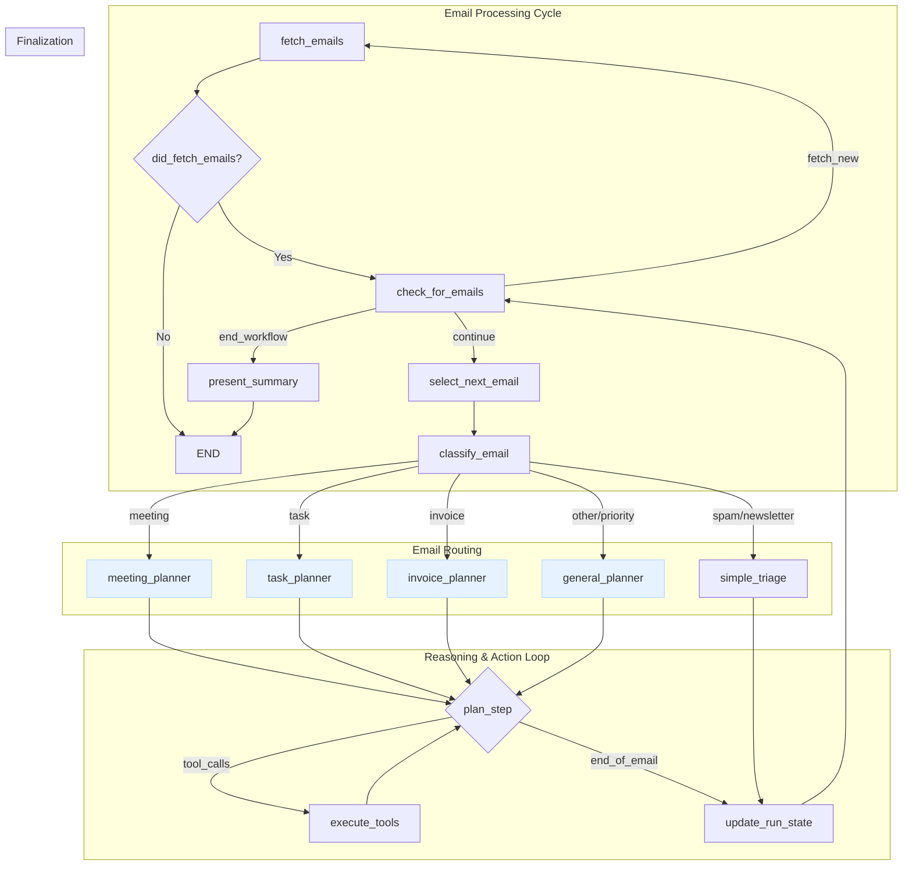

# Email Management Agent: Design Document

**Project:** AgentPlayground/email_assistant
**Version:** 1.0
**Date:** 2024-07-30

---

### 1. Introduction

This document outlines the design and architecture of the Email Management Agent, a system built using LangChain and LangGraph. The agent's primary goal is to intelligently triage, process, and manage incoming emails, automating routine tasks, extracting key information, and facilitating timely responses, all while maintaining user control through a human-in-the-loop mechanism.

### 2. Overall Architecture Approach

The agent's architecture is designed for modularity, extensibility, and intelligent decision-making, combining the strengths of batch processing with dynamic, LLM-driven reasoning.

**Key Principles:**

*   **Batch Processing:** The agent can efficiently fetch and process multiple emails in a single execution cycle.
*   **Specialized Routing:** Emails are initially classified and then routed to dedicated processing sub-graphs, allowing for focused and efficient handling of different email types (e.g., meetings, tasks, invoices).
*   **Cyclical Reasoning (ReAct Pattern):** Within each specialized sub-graph, the agent employs a `plan -> execute -> observe` loop. This enables it to handle complex, multi-step tasks that require iterative tool use and dynamic adjustments.
*   **Human-in-the-Loop:** For critical or sensitive actions (e.g., sending emails, creating calendar events), the agent pauses and seeks explicit user approval, ensuring user control and preventing unintended consequences.
*   **Provider Agnostic Email Fetching:** The system is designed with an abstract interface for email fetching, allowing easy integration of different email providers (Gmail, Outlook, etc.) without altering the core agent logic.
*   **Secure Credential Management:** Utilizes Google Secret Manager for storing and accessing API credentials, enhancing security and manageability.

### 3. Core Components

#### 3.1. Agent State (`EmailAgentState`)

The `EmailAgentState` is the central data structure that holds all information relevant to the agent's current operation. It acts as the agent's memory, accumulating and updating data as it progresses through the graph.

```python
from typing import TypedDict, List, Annotated, Sequence, Literal, Dict, Any, Optional
from langchain_core.messages import BaseMessage

class Email(TypedDict):
    """A structured representation of a single email."""
    id: str
    sender: str
    subject: str
    body: str
    received_at: str

class UserPreferences(TypedDict):
    """User-defined rules and settings for the agent."""
    priority_senders: List[str]
    auto_archive_rules: Dict[str, Any]
    approval_required_for: List[str]  # e.g., ["send_email", "create_event"]

class EmailAgentState(TypedDict):
    """
    The central state for the email agent. It's passed between nodes in the graph,
    accumulating data as the agent processes emails.
    """
    # --- Batch Processing State ---
    inbox: List[EmailObject]            # The list of emails fetched for this run
    current_email_index: int            # The index of the email currently being processed
    processed_email_ids: List[str]      # IDs of emails successfully processed in this run

    # --- Per-Email Processing State (cleared for each new email) ---
    current_email: Optional[EmailObject] # The email object currently under analysis
    classification: Optional[Literal["priority", "meeting", "task", "invoice", "newsletter", "spam", "other"]]
    summary: Optional[str]
    extracted_data: Optional[Dict[str, Any]]      # For invoices, contact info, etc.

    # --- Core Reasoning State ---
    messages: Annotated[Sequence[BaseMessage], "The conversation history for the current email"]

    # --- Configuration ---
    user_preferences: UserPreferences   # User-defined rules and settings
    # The client for performing email actions (provider-agnostic)
    email_actions_client: Optional[BaseEmailActions] = None
    # The email fetcher instance, needed for tool selection
    email_fetcher: Optional[BaseEmailFetcher] = None
```

*Implementation Note: In practice, the agent state is dynamically augmented at runtime. The `fetch_emails_node` adds the active `email_fetcher` instance and a provider-specific `email_actions_client` (e.g., `OutlookActions`) to the state so they can be accessed by downstream nodes and tools.*

**Key Fields:**

*   `inbox`: A list of `Email` instances representing the batch of emails to be processed.
*   `current_email_index`: Tracks which email in the `inbox` is currently being processed.
*   `processed_email_ids`: Stores IDs of emails that have completed processing in the current run.
*   `current_email`: The specific `EmailObject` being analyzed by the agent at any given time.
*   `classification`: The category assigned to `current_email` by the LLM.
*   `summary`: A concise summary of `current_email`.
*   `extracted_data`: Structured data extracted from `current_email` (e.g., invoice details, meeting times).
*   `messages`: A sequence of `BaseMessage` objects, forming the conversational history for the LLM's reasoning process for the *current email*.
*   `user_preferences`: Configuration settings provided by the user, influencing agent behavior.

#### 3.2. Email Fetching Layer

This layer is responsible for securely connecting to email providers and retrieving raw email data, which is then parsed into a standardized `Email` format.

##### 3.2.1. `BaseEmailFetcher` (Abstract Base Class)

Defines the interface for any email fetching implementation, ensuring provider independence.

```python
# From src/tools/email_fetcher.py
class BaseEmailFetcher(ABC):
    """Abstract base class for fetching emails from a provider."""
    @abstractmethod
    def connect(self) -> Any: ...
    @abstractmethod
    def fetch_raw_unread_emails(self, service: Any, max_count: int) -> List[Dict[str, Any]]: ...
    @abstractmethod
    def parse_email(self, raw_email: Dict[str, Any]) -> Optional[EmailObject]: ...
    def get_emails(self, max_count: int = 10) -> List[EmailObject]: ...
```

##### 3.2.2. `GmailFetcher` (Concrete Implementation)

Provides the specific logic for connecting to the Gmail API, handling OAuth2, fetching messages, and parsing them.

*   **Authentication:** Uses `google.auth` and `google_auth_oauthlib` for OAuth 2.0.
*   **Credential Management:** Integrates with Google Secret Manager to store and retrieve `gmail-credentials` (client ID/secret) and `gmail-token` (access/refresh tokens), eliminating the need for local `credentials.json` and `token.json` files.
*   **Email Retrieval:** Fetches unread emails from the user's inbox using `gmail.users().messages().list()`.
*   **Parsing:** Decodes and extracts relevant fields (ID, sender, subject, body, received date) from the raw Gmail API response into an `EmailObject`.

##### 3.2.3. `OutlookFetcher` (Concrete Implementation)

Provides the logic for Microsoft Outlook.
*   **Authentication:** Uses the `msal` library to implement a device flow, which is robust for CLI applications. It caches the user's token in Google Secret Manager (`outlook-token-cache`) to enable silent authentication on subsequent runs.
*   **Scopes:** Crucially, it requests not only mail permissions (`Mail.Read`) but also calendar permissions (`Calendars.ReadWrite`), as the `OutlookCalendarTool` relies on the fetcher's authenticated state to make its own API calls.
*   **Credential Management:** Fetches the application's `client_id` from the `outlook_credentials` secret in Google Secret Manager.

##### 3.2.4. `fetch_emails_node` (LangGraph Node)

This is the initial node in the LangGraph workflow.

*   **Purpose:** To initiate the email fetching process.
*   **Action:** Instantiates a `GmailFetcher` (or other configured fetcher), calls its `get_emails` method, and populates the `state['inbox']` with the fetched `EmailObject`s. It also initializes `current_email_index` and clears per-email processing fields.
*   **State Update:** `state['inbox']`, `state['current_email_index']`, `state['processed_email_ids']`, and clears per-email fields.

### 4. User Interface: Telegram Bot

To ensure the agent is accessible and intuitive for non-technical users, the primary interface will be a Telegram bot. This approach moves beyond a simple CLI, providing a rich, interactive, and asynchronous experience.

#### 4.1. Rationale

*   **User-Friendly:** The chat interface is familiar to everyone, requiring no special training.
*   **Rich Interactive Elements:** Telegram supports buttons and formatted messages, which are ideal for structured interactions like approvals and reports.
*   **Asynchronous & Real-Time:** The agent can notify the user in real-time when input is needed, and the user can respond at their convenience.
*   **Persistent History:** All interactions, including summary reports and user decisions, are automatically logged in the chat history.

A user will initiate a processing run by sending a command (e.g., `/process_emails`) to the bot.

#### 4.2. Human-in-the-Loop (HIL) Interactions

All HIL tasks will be managed through the Telegram interface, providing a seamless experience.

*   **Action Approval (`human_review` node):** When the agent needs to confirm a critical action, it will send a message with inline buttons.
    > **🤖 Agent Bot:**
    > I have drafted a reply to "John Doe". Shall I send it?
    > `[ ✅ Send ]` `[ ❌ Cancel ]`
*   **Information Gathering (`ask_user_for_input` tool):** When the agent needs more information, it will ask a question. It can provide suggestions as buttons or allow the user to type a response.
    > **🤖 Agent Bot:**
    > The email from "Alice" suggests a meeting but gives no time. What time should I propose?
    > `[ Suggest Tomorrow Morning ]` `[ Suggest Tomorrow Afternoon ]`

#### 4.3. Batch Execution Summary Report

At the end of each batch run, the agent will send a consolidated summary report to the user via Telegram. This provides clear accountability for the agent's actions.

The report will be structured as follows for each processed email:

| Field                 | Description                                                     | Example                                                  |
| :---------------------| :-------------------------------------------------------------- | :------------------------------------------------------- |
| **Email ID**          | Clear identifier for the email.                                 | `From: a.smith@example.com`, `Subject: Project Sync`     |
| **Classification**    | The category assigned by the agent.                             | `Meeting Request`                                        |
| **Action Taken**      | The high-level action the agent performed.                      | `Scheduled Calendar Event`                               |
| **Status**            | The final state of the action.                                  | `✅ Success`, `❌ Failure`, `🟡 Awaiting Approval`      |
| **Details**           | A brief, human-readable explanation for the status.             | `Event "Project Sync" created for Oct 3.`                |


### 5. LangGraph Workflow Architecture

The agent's workflow is structured as a main batch processing loop that dispatches individual emails to specialized reasoning sub-graphs.



Here's a breakdown of the nodes:

#### 5.1. Nodes (The "Doers")

*   **`fetch_emails_node`**: Entry point, fetches a batch of emails.
*   **`select_next_email_node`**: Moves to the next email in the `inbox`.
*   **`classify_email_node`**: Initial triage and categorization of the `current_email`.
*   **`simple_triage_node`**: For straightforward actions like archiving, bypassing the complex reasoning loop.
*   **`meeting_planner` / `task_planner` / `invoice_planner` / `general_planner`**: Specialized entry points into the core reasoning loop, tailored to specific email types.
*   **`plan_step`**: The core LLM-driven reasoning node that decides the next action (call a tool, request approval, finish).
*   **`execute_tools`**: A `ToolNode` that runs the functions requested by the `plan_step` LLM.
*   **`human_interaction` (Human-in-the-Loop)**:
    *   **Information Gathering (`ask_user_for_input` tool):** The `plan_step` LLM calls this tool with a question. The tool's implementation pauses the graph and sends the question to the user via the **Telegram Bot**. The user's response is returned as the tool's output, allowing the LLM to resume planning.
    *   **Action Approval (`human_review` node):** For critical actions, the agent routes to this node. It pauses the graph and presents the action to the user for "yes/no" approval via **Telegram buttons**. Conditional edges then route the workflow based on the user's decision.
*   **`update_run_state`**: Marks the current email as processed and collects its outcome data for the final report. It adds a summary dictionary for the processed email to a `run_summary` list in the agent state.
*   **`present_summary` (New Node)**:
    *   **Purpose:** To report the final results to the user.
    *   **Action:** This is the final node in the workflow. It takes the `run_summary` list from the agent state, formats it into the **Batch Execution Summary Report**, and sends it as a single message to the user via the **Telegram Bot**.

#### 5.2. Edges (The "Deciders")

*   **`has_emails_to_process?`**: A conditional edge that controls the main batch processing loop. It checks if `state['current_email_index']` is within the bounds of `state['inbox']`.
*   **`classify_email` -> Router**: A conditional edge that routes the `current_email` to the appropriate specialized planner based on `state['classification']`.
*   **`plan_step` -> Conditional Edges**: The core decision-making logic for the LLM. It routes based on the LLM's output:
    *   To `execute_tools` if `tool_calls` are present.
    *   To `human_review` if user approval is required (e.g., for sending an email or creating an event).
    *   To `update_run_state` if the task for the current email is complete.
*   **`execute_tools` -> `plan_step`**: After a tool executes, the output is fed back to the `plan_step` for further reasoning.
*   **`human_review` -> Conditional Edges**: Routes based on user input:
    *   `Approve` -> `execute_tools` (to perform the approved action).
    *   `Reject/Edit` -> `plan_step` (to allow the LLM to re-plan or generate a new draft).
    *   `Cancel` -> `update_run_state` (to stop processing this email).
*   **`update_run_state` -> `has_emails_to_process?`**: Closes the loop for the current email and returns to check for the next email in the batch.
*   **`check_for_emails` -> `present_summary`**: When all emails in the batch have been processed, this edge directs the graph to the final reporting node.

### 6. Tool Integration Layer

The agent will interact with external services through a set of well-defined tools and action clients.

*   **Email Action Clients (`BaseEmailActions`):** Instead of individual LLM-callable tools for every email action, the design uses provider-specific "action clients" (`GmailActions`, `OutlookActions`). These clients implement a common interface with methods for all required email operations. Nodes can then call these methods directly. The core capabilities to be implemented in these clients are:
    *   `send_email`: To compose and send replies/new emails.
    *   `update_email_labels`: To categorize and organize emails (e.g., mark as read, archive).
    *   `move_email_to_folder`: To move emails to specific folders.
    *   `mark_as_spam`: To report and move spam emails.
*   **Human Interaction Tools:**
    *   `ask_user_for_input`: Pauses the agent and asks the user a clarifying question via the **Telegram Bot**.
*   **Calendar Tools:**
    *   `check_availability`: To query free/busy times in the user's calendar.
    *   `create_event`: To schedule new calendar events.
    *   `update_event`: To modify existing events.
    
*   **Task Management Tools:**
    *   `create_task`: To add items to a to-do list (e.g., Todoist, Asana).
    *   `set_reminder`: To schedule follow-up reminders.
    *   `update_task_status`: To mark tasks as complete.
*   **CRM Tools (Future):**
    *   `create_lead`: To add new contacts to a CRM system.
    *   `update_contact_info`: To update existing contact details.

### 7. Memory and Persistence

*   **LangGraph Checkpointer:** Utilizes LangGraph's built-in checkpointer to persist the agent's state. This is critical for the asynchronous nature of the Telegram interface, allowing the agent to pause and wait for user input without losing context.
*   **Thread-based Execution:** A unique `thread_id` (which can be based on the Telegram `chat_id`) will be used to maintain a separate conversational state for each user interacting with the bot.

### 8. Configuration and Customization

*   **`UserPreferences`:** The `EmailAgentState` includes a `UserPreferences` object to store user-specific rules.
*   **Environment Variables:** Critical configurations (API keys, model names, **Telegram Bot Token**) are managed via environment variables.
*   **Secret Manager:** All sensitive credentials are externalized to Google Secret Manager.
