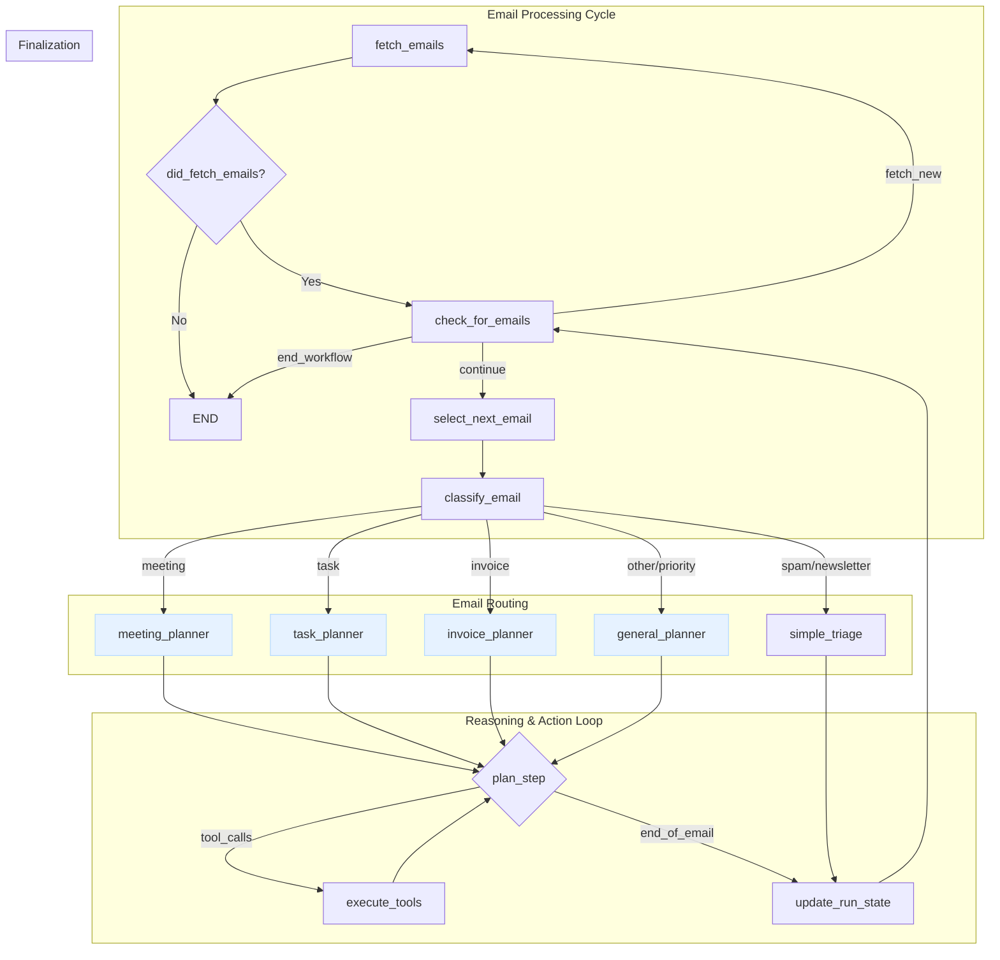

# Email Management Agent: Design Document

**Project:** AgentPlayground/email_assistant
**Version:** 1.0
**Date:** 2024-07-30

---

### 1. Introduction

This document outlines the design and architecture of the Email Management Agent, a system built using LangChain and LangGraph. The agent's primary goal is to intelligently triage, process, and manage incoming emails, automating routine tasks, extracting key information, and facilitating timely responses, all while maintaining user control through a human-in-the-loop mechanism.

### 2. Overall Architecture Approach

The agent's architecture is designed for modularity, extensibility, and intelligent decision-making, combining the strengths of batch processing with dynamic, LLM-driven reasoning.

**Key Principles:**

*   **Batch Processing:** The agent can efficiently fetch and process multiple emails in a single execution cycle.
*   **Specialized Routing:** Emails are initially classified and then routed to dedicated processing sub-graphs, allowing for focused and efficient handling of different email types (e.g., meetings, tasks, invoices).
*   **Cyclical Reasoning (ReAct Pattern):** Within each specialized sub-graph, the agent employs a `plan -> execute -> observe` loop. This enables it to handle complex, multi-step tasks that require iterative tool use and dynamic adjustments.
*   **Human-in-the-Loop:** For critical or sensitive actions (e.g., sending emails, creating calendar events), the agent pauses and seeks explicit user approval, ensuring user control and preventing unintended consequences.
*   **Provider Agnostic Email Fetching:** The system is designed with an abstract interface for email fetching, allowing easy integration of different email providers (Gmail, Outlook, etc.) without altering the core agent logic.
*   **Secure Credential Management:** Utilizes Google Secret Manager for storing and accessing API credentials, enhancing security and manageability.

### 3. Core Components

#### 3.1. Agent State (`EmailAgentState`)

The `EmailAgentState` is the central data structure that holds all information relevant to the agent's current operation. It acts as the agent's memory, accumulating and updating data as it progresses through the graph.

```python
from typing import TypedDict, List, Annotated, Sequence, Literal, Dict, Any, Optional
from langchain_core.messages import BaseMessage

class Email(TypedDict):
    """A structured representation of a single email."""
    id: str
    sender: str
    subject: str
    body: str
    received_at: str

class UserPreferences(TypedDict):
    """User-defined rules and settings for the agent."""
    priority_senders: List[str]
    auto_archive_rules: Dict[str, Any]
    approval_required_for: List[str]  # e.g., ["send_email", "create_event"]

class EmailAgentState(TypedDict):
    """
    The central state for the email agent. It's passed between nodes in the graph,
    accumulating data as the agent processes emails.
    """
    # --- Batch Processing State ---
    inbox: List[EmailObject]            # The list of emails fetched for this run
    current_email_index: int            # The index of the email currently being processed
    processed_email_ids: List[str]      # IDs of emails successfully processed in this run

    # --- Per-Email Processing State (cleared for each new email) ---
    current_email: Optional[EmailObject] # The email object currently under analysis
    classification: Optional[Literal["priority", "meeting", "task", "invoice", "newsletter", "spam", "other"]]
    summary: Optional[str]
    extracted_data: Optional[Dict[str, Any]]      # For invoices, contact info, etc.

    # --- Core Reasoning State ---
    messages: Annotated[Sequence[BaseMessage], "The conversation history for the current email"]

    # --- Configuration ---
    user_preferences: UserPreferences   # User-defined rules and settings
    # The client for performing email actions (provider-agnostic)
    email_actions_client: Optional[BaseEmailActions] = None
    # The email fetcher instance, needed for tool selection
    email_fetcher: Optional[BaseEmailFetcher] = None
```

*Implementation Note: In practice, the agent state is dynamically augmented at runtime. The `fetch_emails_node` adds the active `email_fetcher` instance and a provider-specific `email_actions_client` (e.g., `OutlookActions`) to the state so they can be accessed by downstream nodes and tools.*

**Key Fields:**

*   `inbox`: A list of `Email` instances representing the batch of emails to be processed.
*   `current_email_index`: Tracks which email in the `inbox` is currently being processed.
*   `processed_email_ids`: Stores IDs of emails that have completed processing in the current run.
*   `current_email`: The specific `EmailObject` being analyzed by the agent at any given time.
*   `classification`: The category assigned to `current_email` by the LLM.
*   `summary`: A concise summary of `current_email`.
*   `extracted_data`: Structured data extracted from `current_email` (e.g., invoice details, meeting times).
*   `messages`: A sequence of `BaseMessage` objects, forming the conversational history for the LLM's reasoning process for the *current email*.
*   `user_preferences`: Configuration settings provided by the user, influencing agent behavior.

#### 3.2. Email Fetching Layer

This layer is responsible for securely connecting to email providers and retrieving raw email data, which is then parsed into a standardized `Email` format.

##### 3.2.1. `BaseEmailFetcher` (Abstract Base Class)

Defines the interface for any email fetching implementation, ensuring provider independence.

```python
# From src/tools/email_fetcher.py
class BaseEmailFetcher(ABC):
    """Abstract base class for fetching emails from a provider."""
    @abstractmethod
    def connect(self) -> Any: ...
    @abstractmethod
    def fetch_raw_unread_emails(self, service: Any, max_count: int) -> List[Dict[str, Any]]: ...
    @abstractmethod
    def parse_email(self, raw_email: Dict[str, Any]) -> Optional[EmailObject]: ...
    def get_emails(self, max_count: int = 10) -> List[EmailObject]: ...
```

##### 3.2.2. `GmailFetcher` (Concrete Implementation)

Provides the specific logic for connecting to the Gmail API, handling OAuth2, fetching messages, and parsing them.

*   **Authentication:** Uses `google.auth` and `google_auth_oauthlib` for OAuth 2.0.
*   **Credential Management:** Integrates with Google Secret Manager to store and retrieve `gmail-credentials` (client ID/secret) and `gmail-token` (access/refresh tokens), eliminating the need for local `credentials.json` and `token.json` files.
*   **Email Retrieval:** Fetches unread emails from the user's inbox using `gmail.users().messages().list()`.
*   **Parsing:** Decodes and extracts relevant fields (ID, sender, subject, body, received date) from the raw Gmail API response into an `EmailObject`.

##### 3.2.3. `OutlookFetcher` (Concrete Implementation)

Provides the logic for Microsoft Outlook.
*   **Authentication:** Uses the `msal` library to implement a device flow, which is robust for CLI applications. It caches the user's token in Google Secret Manager (`outlook-token-cache`) to enable silent authentication on subsequent runs.
*   **Scopes:** Crucially, it requests not only mail permissions (`Mail.Read`) but also calendar permissions (`Calendars.ReadWrite`), as the `OutlookCalendarTool` relies on the fetcher's authenticated state to make its own API calls.
*   **Credential Management:** Fetches the application's `client_id` from the `outlook_credentials` secret in Google Secret Manager.

##### 3.2.4. `fetch_emails_node` (LangGraph Node)

This is the initial node in the LangGraph workflow.

*   **Purpose:** To initiate the email fetching process.
*   **Action:** Instantiates a `GmailFetcher` (or other configured fetcher), calls its `get_emails` method, and populates the `state['inbox']` with the fetched `EmailObject`s. It also initializes `current_email_index` and clears per-email processing fields.
*   **State Update:** `state['inbox']`, `state['current_email_index']`, `state['processed_email_ids']`, and clears per-email fields.

### 4. LangGraph Workflow Architecture

The agent's workflow is structured as a main batch processing loop that dispatches individual emails to specialized reasoning sub-graphs.



Here's a breakdown based on the design:

   1. **Classifier as a Router:** The classify_email node acts as a "router" agent. Its sole responsibility is to perform an initial assessment and delegate the email to the correct specialist.

   2. **Specialized Sub-Agents (Planners):** The different planners (meeting_planner, task_planner, invoice_planner, etc.) are designed to be "specialized sub-agents."
       * Focused Expertise: Each planner is the entry point to a sub-graph that is an expert in one domain. For example, the meeting_planner is primed with context and tools specifically for
         scheduling, while the invoice_planner is focused on data extraction and financial workflows.
       * Tailored Prompts: As the design document notes, these planners will prompt the LLM with context-specific instructions (e.g., "You are a meeting scheduler..."). This is a classic way
         to invoke a specialized agent.
       * Dedicated Tools: While not explicitly stated as a constraint, it's implied that each sub-agent would primarily use a toolset relevant to its specialty (e.g., calendar tools for the
         meeting agent, task management tools for the task agent).

  This is a powerful and common pattern in agentic design. Instead of one monolithic agent trying to do everything, you have a router that passes tasks to specialized agents who can
  perform their function more efficiently and reliably.


#### 4.1. Nodes (The "Doers")

*   **`fetch_emails_node`**: (Already described) Entry point, fetches a batch of emails.
*   **`select_next_email_node`**:
    *   **Purpose:** Moves to the next email in the `inbox`.
    *   **Action:** Increments `current_email_index` and sets `state['current_email']` to the next email in the `inbox`.
    *   **State Update:** Clears per-email specific fields (`classification`, `summary`, `extracted_data`, `messages`).        
*   **`classify_email_node`**:
    *   **Purpose:** Initial triage and categorization of the `current_email`.
    *   **Action:** Calls an LLM using a structured prompt template loaded from `prompts.yaml` via the `PromptManager`. It includes robust parsing to handle variations in the LLM's output and defaults to "other" if the classification is invalid.
    *   **State Update:** Populates `state['classification']`.
*   **`simple_triage_node`**: A dedicated node for straightforward actions like marking as spam or moving newsletters to a specific folder. This bypasses the complex reasoning loop for simple cases by directly using an `EmailActions` client.
*   **`meeting_planner` / `task_planner` / `invoice_planner` / `general_planner`**:
    *   **Purpose:** Specialized entry points into the core reasoning loop, tailored to specific email types.
    *   **Action:** These nodes use the `PromptManager` to construct a detailed `ChatPromptTemplate` specific to their task (e.g., `get_meeting_planner_chat_prompt`). This template, which includes a system prompt with detailed instructions and a human prompt containing the email data, is used to create the initial `messages` list that kicks off the reasoning loop. The `meeting_planner` also intelligently retrieves the user's own email address from the fetcher's account details to ensure the user is included in event invitations.
*   **`plan_step`**:
    *   **Purpose:** The core LLM-driven reasoning node. It analyzes the current state and decides the next action.
    *   **Action:** Calls an LLM (e.g., Gemini) with the `state['messages']` (which includes the email summary, extracted data, and previous LLM/tool outputs). The LLM decides whether to:
        *   Call a tool (e.g., `create_calendar_event`, `add_to_todo_list`).
        *   Generate a draft response.
        *   Request human approval.
        *   Indicate task completion for the current email.
    *   **State Update:** Appends `AIMessage` (potentially with `tool_calls`) to `state['messages']`.
*   **`execute_tools`**:
    *   **Purpose:** Executes the tools requested by the `plan_step` LLM.
    *   **Action:** This is a `ToolNode` that automatically calls the functions specified in `tool_calls` (e.g., `calendar_api.create_event`, `gmail_api.apply_label`).
    *   **State Update:** Appends `ToolMessage` (tool output) to `state['messages']`.
*   **`human_interaction` (Human-in-the-Loop)**:
    *   **Purpose:** Provides two distinct mechanisms for human-in-the-loop interaction, ensuring the user remains in control.
    *   **1. Information Gathering (via a Tool):** When the agent lacks sufficient information to proceed with a plan (e.g., an email asks to "schedule a meeting next week" without a specific time), it uses a dedicated tool called `ask_user_for_input`.
        *   **Workflow:** The `plan_step` LLM calls this tool with a specific question. The tool's implementation pauses the graph and prompts the user for input via the command line. The user's response is returned as the tool's output, added to the `messages` history, and fed back into the `plan_step` node, allowing the LLM to resume planning with the new information. This models the user as just another tool the agent can query.
    *   **2. Action Approval (via a `human_review` node):** For critical, state-changing actions (like sending an email or creating a calendar event), the agent first formulates the complete action. It then routes to a `human_review` node.
        *   **Workflow:** This node pauses the graph and presents the fully-formed action to the user for a "yes/no" approval. Based on the user's decision, conditional edges route the workflow to either execute the action or abort and re-plan.
*   **`update_run_state`**:
    *   **Purpose:** Marks the current email as processed and prepares the state for the next email in the batch.
    *   **Action:** Adds `current_email.id` to `state['processed_email_ids']` and clears all per-email specific fields (`current_email`, `classification`, `summary`, `extracted_data`, `messages`) to ensure a clean slate for the next iteration.

#### 4.2. Edges (The "Deciders")

*   **`has_emails_to_process?`**: A conditional edge that controls the main batch processing loop. It checks if `state['current_email_index']` is within the bounds of `state['inbox']`.
*   **`classify_email` -> Router**: A conditional edge that routes the `current_email` to the appropriate specialized planner based on `state['classification']`.
*   **`plan_step` -> Conditional Edges**: The core decision-making logic for the LLM. It routes based on the LLM's output:
    *   To `execute_tools` if `tool_calls` are present.
    *   To `human_review` if user approval is required (e.g., for sending an email or creating an event).
    *   To `update_run_state` if the task for the current email is complete.
*   **`execute_tools` -> `plan_step`**: After a tool executes, the output is fed back to the `plan_step` for further reasoning.
*   **`human_review` -> Conditional Edges**: Routes based on user input:
    *   `Approve` -> `execute_tools` (to perform the approved action).
    *   `Reject/Edit` -> `plan_step` (to allow the LLM to re-plan or generate a new draft).
    *   `Cancel` -> `update_run_state` (to stop processing this email).
*   **`update_run_state` -> `has_emails_to_process?`**: Closes the loop for the current email and returns to check for the next email in the batch.

### 5. Tool Integration Layer

The agent will interact with external services through a set of well-defined tools and action clients.

*   **Email Action Clients (`BaseEmailActions`):** Instead of individual LLM-callable tools for every email action, the design uses provider-specific "action clients" (`GmailActions`, `OutlookActions`). These clients implement a common interface with methods for all required email operations. Nodes can then call these methods directly. The core capabilities to be implemented in these clients are:
    *   `send_email`: To compose and send replies/new emails.
    *   `update_email_labels`: To categorize and organize emails (e.g., mark as read, archive).
    *   `move_email_to_folder`: To move emails to specific folders.
    *   `mark_as_spam`: To report and move spam emails.
*   **Human Interaction Tools:**
    *   `ask_user_for_input`: Pauses the agent and asks the user a clarifying question to gather missing information needed for planning.
*   **Calendar Tools:**
    *   `check_availability`: To query free/busy times in the user's calendar.
    *   `create_event`: To schedule new calendar events.
    *   `update_event`: To modify existing events.
    
*   **Task Management Tools:**
    *   `create_task`: To add items to a to-do list (e.g., Todoist, Asana).
    *   `set_reminder`: To schedule follow-up reminders.
    *   `update_task_status`: To mark tasks as complete.
*   **CRM Tools (Future):**
    *   `create_lead`: To add new contacts to a CRM system.
    *   `update_contact_info`: To update existing contact details.

### 6. Memory and Persistence

*   **LangGraph Checkpointer:** Utilizes LangGraph's built-in checkpointer (e.g., `MemorySaver` for development, `FirestoreSaver` for production) to persist the agent's state across runs and allow for recovery or inspection.
*   **Thread-based Execution:** LangGraph's `thread_id` mechanism will be used to manage separate conversational states for different processing contexts if needed, though for email processing, a single thread per batch run is initially sufficient.

### 7. Configuration and Customization

*   **`UserPreferences`:** The `RefinedEmailAgentState` includes a `UserPreferences` object to store user-specific rules, such as priority senders, auto-archiving rules, and approval thresholds for automated actions.
*   **Environment Variables:** Critical configurations (API keys, model names, log levels) are managed via environment variables and a `.env` file.
*   **Secret Manager:** All sensitive credentials are externalized to Google Secret Manager.
